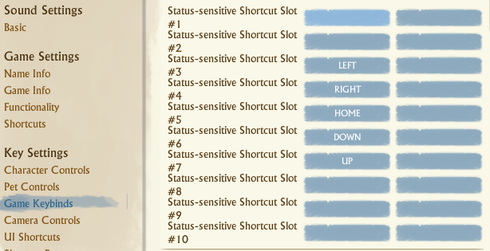

## Fishing bot - Archeage

# This script only kills the fish when you get their target, it not delivers or start fishing

#### If doesn't work, contact me. If it works, you can buy me a [☕](https://www.buymeacoffee.com/gamoridev)

## How to

#### - Install python 3.7 https://www.python.org/downloads/release/python-379/

#### - Open cmd at project folder

#### - Install requirements packages with the following command

`pip install pywin32 opencv-python`
and
`pip install -r requirements.txt`

#### - Configure your fishing skills ingame like as

#### - Open fishing.py with double click
